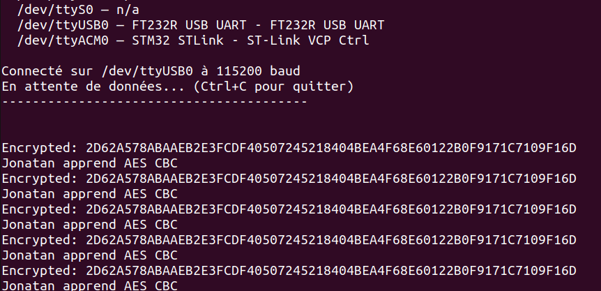

# AES-Implementation-and-USART-on-the-STM32L476RG-board-
Dans ce projet, j'implemente l'algorithme de cryptographie AES sur la carte STM32L476RG

##  TinyAES
J'utilise TinyAES, une implementation léger pour l'algorithme de cryptography AES.

>  wget -O src/aes.c https://raw.githubusercontent.com/kokke/tiny-AES-c/master/aes.c

> wget -O inc/aes.h https://raw.githubusercontent.com/kokke/tiny-AES-c/master/aes.h

## Pour generer la clé 

> 𝚘𝚙𝚎𝚗𝚜𝚜𝚕 𝚛𝚊𝚗𝚍 -𝚑𝚎𝚡 𝟷𝟼

## Pour mettre en place l'environment de developpement
Pour pouvoir developper en STM32 sur linux, je me suis inspiré du projet officiel de stm32, lien ici.
> https://github.com/STMicroelectronics/cmsis-device-l4.git 

# Resultat 

##### Système d'exploitation utilisé 
 Ubuntu 22.04.5
